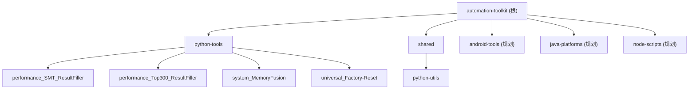

# Automation Toolkit

> 自动化测试工具集 - 统一管理各类测试工具和小脚本
> 版本：v0.1.0 | 更新时间：2026-02-06

---

## 变更记录 (Changelog)

| 日期 | 变更内容 |
|------|----------|
| 2026-02-06 | 新增 Top300 Result Filler、MemoryFusion、Factory-Reset 工具模块 |
| 2026-02-04 19:23:02 | 初始化 CLAUDE.md 文档，完成全仓扫描与模块识别 |

---

## 项目愿景

Automation Toolkit 是为 Tinno Auto 内部测试团队设计的自动化工具集，旨在：

1. **统一管理**：集中管理各类测试工具和脚本，避免分散存储
2. **提高效率**：自动化处理重复性测试数据整理工作
3. **易于扩展**：模块化设计，便于添加新的工具和功能
4. **跨平台支持**：支持 Windows、Linux、macOS

---

## 架构总览

```
automation-toolkit/
├── python-tools/              # Python 工具集
│   ├── performance_SMT_ResultFiller/     # SMT 性能测试结果填充工具
│   ├── performance_Top300_ResultFiller/   # Top300 应用启动时间数据填充工具
│   ├── system_MemoryFusion/              # 内存融合工具
│   └── universal_Factory-Reset/          # 通用恢复出厂设置工具
├── shared/                    # 共享资源
│   └── python-utils/          # 共享 Python 工具库
├── android-tools/             # Android 工具集（规划中）
├── java-platforms/            # Java 平台（规划中）
├── node-scripts/              # Node.js 脚本（规划中）
├── docs/                      # 统一文档（规划中）
├── toolkit.ps1                # Windows PowerShell 入口脚本
├── toolkit.bat                # Windows Batch 入口脚本
├── Makefile                   # Linux/Mac 入口
└── .github/workflows/         # CI/CD 配置
```

---

## 模块结构图



---

## 模块索引

| 模块路径 | 语言 | 职责描述 | 状态 |
|----------|------|----------|------|
| [python-tools/performance_SMT_ResultFiller](./python-tools/performance_SMT_ResultFiller/CLAUDE.md) | Python | SMT 性能测试结果自动填充 Excel 工具（动效丢帧/滑动丢帧） | 活跃 |
| [python-tools/performance_Top300_ResultFiller](./python-tools/performance_Top300_ResultFiller/CLAUDE.md) | Python | Top300 应用启动时间数据自动填充 Excel 工具 | 活跃 |
| [python-tools/system_MemoryFusion](./python-tools/system_MemoryFusion/) | Python | 内存融合工具 | 活跃 |
| [python-tools/universal_Factory-Reset](./python-tools/universal_Factory-Reset/) | Python | 通用恢复出厂设置工具 | 活跃 |
| [shared/python-utils](./shared/python-utils/CLAUDE.md) | Python | 共享 Python 工具库 | 初始 |

---

## 运行与开发

### Windows 环境

```powershell
# 进入工具目录
cd python-tools\performance_SMT_ResultFiller
# 或
cd python-tools\performance_Top300_ResultFiller

# 安装依赖
pip install -r requirements.txt

# 运行工具
python main.py
# 或双击 Start.bat
```

### Linux/Mac 环境

```bash
# 进入工具目录
cd python-tools/performance_SMT_ResultFiller
# 或
cd python-tools/performance_Top300_ResultFiller

# 安装依赖
pip install -r requirements.txt

# 运行工具
python main.py
```

### 环境要求

- **Python**: 3.8+
- **依赖管理**: pip (Python), make (Linux/Mac)

---

## 测试策略

| 模块 | 测试框架 | 测试状态 | 备注 |
|------|----------|----------|------|
| performance_SMT_ResultFiller | pytest | 未配置 | CI 中预留测试命令 |
| performance_Top300_ResultFiller | pytest | 未配置 | CI 中预留测试命令 |
| python-utils | - | 无测试 | 空模块，待开发 |

**CI 配置**: `.github/workflows/python-tools.yml`
- Lint: flake8（非阻塞）
- Test: pytest（非阻塞）

---

## 编码规范

### Python 代码规范

- **Style**: 遵循 PEP 8
- **Lint**: flake8
- **文档字符串**: Google 风格
- **编码**: UTF-8
- **日志**: 使用 `logging` 模块，输出到文件和控制台

### 命名约定

- 文件夹名: 小写，下划线分隔 (如 `performance_SMT_ResultFiller` 为历史遗留，新模块应使用 `performance_smt_result_filler`)
- 模块名: 小写，下划线分隔
- 类名: 大驼峰 (PascalCase)
- 函数/变量: 小写，下划线分隔

### 忽略规则

项目忽略以下内容（来自 `.gitignore`）：

- Python: `__pycache__/`, `*.pyc`, `*.egg-info/`, `.pytest_cache/`, `*.log`
- Java: `target/`, `*.jar`, `*.war`
- Android: `*.apk`, `*.dex`, `.gradle/`
- Node.js: `node_modules/`, `*.eslintcache`
- IDE: `.idea/`, `.vscode/`, `*.iml`
- 项目特定: `*.xlsx`, `*.xls`, `backup/`, `*.hprof`
- 临时文件: `*.tmp`, `*.bak`, `*.cache`, `.ace-tool/`, `.claude/`

---

## AI 使用指引

### 项目上下文

这是一个**内部测试工具集**，主要用于：

1. 自动化处理 SMT 性能测试数据（动效丢帧/滑动丢帧）
2. 自动化处理 Top300 应用启动时间测试数据
3. 内存融合和恢复出厂设置工具

### 关键业务规则

1. **SMT 动效丢帧处理**：
   - 按文件夹索引顺序匹配 Tcid
   - 读取 `trace_analyse_result.xlsx` 中的 `总丢帧数` 列
   - 填写到目标 Excel 的"动效丢帧" sheet

2. **SMT 滑动丢帧处理**：
   - 按文件夹名称匹配 Purpose 列
   - 读取 `FrameOver33ms`、`FrameOver50ms` 列
   - 填写到目标 Excel 的"滑动连续丢帧" sheet

3. **Top300 启动时间处理**：
   - 读取空载/负载测试报告
   - 保留所有原始数据，只为 AM 且非零行计算非首轮平均值
   - 平均值计算方式：所有值之和 ÷ 10000

### AI 辅助开发建议

1. **添加新工具时**：
   - 在 `python-tools/` 或对应语言目录下创建新子目录
   - 创建独立的 `requirements.txt` 或依赖配置
   - 更新根级 `README.md` 和 `CLAUDE.md`
   - 在本文件"模块索引"中注册新模块

2. **修改现有工具时**：
   - 保持模块化结构（config/reader/writer/transfer 分离）
   - 更新对应的 README.md
   - 添加或更新测试

3. **CI/CD 更新**：
   - 修改 `.github/workflows/python-tools.yml` 添加新的 CI 任务

---

## 相关链接

- 仓库: `d:\Tinno_auto\automation-toolkit`
- 版本: v0.1.0
- 许可证: Internal Use - Tinno Auto
