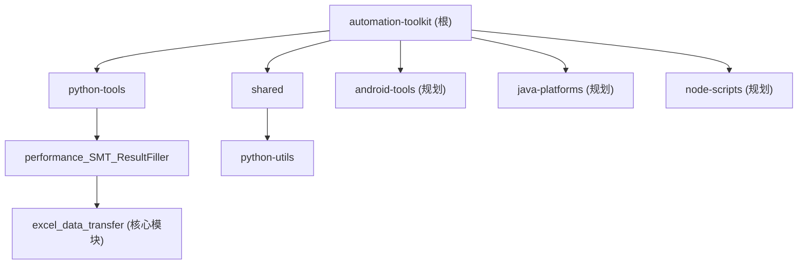

# Automation Toolkit

> 自动化测试工具集 - 统一管理各类测试工具和小脚本
> 版本：v0.1.0 | 更新时间：2026-02-04 19:23:02

---

## 变更记录 (Changelog)

| 日期 | 变更内容 |
|------|----------|
| 2026-02-04 19:23:02 | 初始化 CLAUDE.md 文档，完成全仓扫描与模块识别 |

---

## 项目愿景

Automation Toolkit 是为 Tinno Auto 内部测试团队设计的自动化工具集，旨在：

1. **统一管理**：集中管理各类测试工具和脚本，避免分散存储
2. **提高效率**：自动化处理重复性测试数据整理工作
3. **易于扩展**：模块化设计，便于添加新的工具和功能
4. **跨平台支持**：支持 Windows、Linux、macOS

---

## 架构总览

```
automation-toolkit/
├── python-tools/              # Python 工具集
│   └── performance_SMT_ResultFiller/    # SMT性能测试结果自动填充工具
├── shared/                    # 共享资源
│   └── python-utils/          # 共享 Python 工具库
├── android-tools/             # Android 工具集（规划中）
├── java-platforms/            # Java 平台（规划中）
├── node-scripts/              # Node.js 脚本（规划中）
├── docs/                      # 统一文档（规划中）
├── toolkit.ps1                # Windows PowerShell 入口脚本
├── toolkit.bat                # Windows Batch 入口脚本
├── Makefile                   # Linux/Mac 入口
└── .github/workflows/         # CI/CD 配置
```

---

## 模块结构图



---

## 模块索引

| 模块路径 | 语言 | 职责描述 | 状态 |
|----------|------|----------|------|
| [python-tools/performance_SMT_ResultFiller](./python-tools/performance_SMT_ResultFiller/CLAUDE.md) | Python | SMT 性能测试结果自动填充 Excel 工具 | 活跃 |
| [shared/python-utils](./shared/python-utils/CLAUDE.md) | Python | 共享 Python 工具库 | 初始 |

---

## 运行与开发

### Windows 环境

```powershell
# 查看帮助
.\toolkit.ps1 help
# 或
.\toolkit.bat help

# 安装 Python 工具依赖
.\toolkit.ps1 install-python

# 运行 Performance Excel Filler
.\toolkit.ps1 run-perf-filler
```

### Linux/Mac 环境

```bash
# 查看帮助
make help

# 安装依赖
make install-python

# 运行工具
make run-perf-filler
```

### 环境要求

- **Python**: 3.8+
- **依赖管理**: pip (Python), make (Linux/Mac)

---

## 测试策略

| 模块 | 测试框架 | 测试状态 | 备注 |
|------|----------|----------|------|
| performance_SMT_ResultFiller | pytest | 未配置 | CI 中预留测试命令 |
| python-utils | - | 无测试 | 空模块，待开发 |

**CI 配置**: `.github/workflows/python-tools.yml`
- Lint: flake8（非阻塞）
- Test: pytest（非阻塞）

---

## 编码规范

### Python 代码规范

- **Style**: 遵循 PEP 8
- **Lint**: flake8
- **文档字符串**: Google 风格
- **编码**: UTF-8
- **日志**: 使用 `logging` 模块，输出到文件和控制台

### 命名约定

- 文件夹名: 小写，下划线分隔 (如 `performance_SMT_ResultFiller` 为历史遗留，新模块应使用 `performance_smt_result_filler`)
- 模块名: 小写，下划线分隔
- 类名: 大驼峰 (PascalCase)
- 函数/变量: 小写，下划线分隔

### 忽略规则

项目忽略以下内容（来自 `.gitignore`）：

- Python: `__pycache__/`, `*.pyc`, `*.egg-info/`, `.pytest_cache/`, `*.log`
- Java: `target/`, `*.jar`, `*.war`
- Android: `*.apk`, `*.dex`, `.gradle/`
- Node.js: `node_modules/`, `*.eslintcache`
- IDE: `.idea/`, `.vscode/`, `*.iml`
- 项目特定: `*.xlsx`, `*.xls`, `backup/`, `*.hprof`
- 临时文件: `*.tmp`, `*.bak`, `*.cache`

---

## AI 使用指引

### 项目上下文

这是一个**内部测试工具集**，主要用于：

1. 自动化处理 SMT 性能测试数据
2. 将测试结果从源文件填充到目标 Excel 模板
3. 支持多种设备类型（测试机/竞品机）和数据类型（动效丢帧/滑动丢帧）

### 关键业务规则

1. **动效丢帧处理**：
   - 按文件夹索引顺序匹配 Tcid
   - 读取 `trace_analyse_result.xlsx` 中的 `总丢帧数` 列
   - 填写到目标 Excel 的"动效丢帧" sheet

2. **滑动丢帧处理**：
   - 按文件夹名称匹配 Purpose 列
   - 读取 `FrameOver33ms`、`FrameOver50ms` 列
   - 填写到目标 Excel 的"滑动连续丢帧" sheet

### AI 辅助开发建议

1. **添加新工具时**：
   - 在 `python-tools/` 或对应语言目录下创建新子目录
   - 创建独立的 `requirements.txt` 或依赖配置
   - 更新根级 `Makefile` 和 `toolkit.ps1` 添加快捷命令
   - 在本文件"模块索引"中注册新模块

2. **修改现有工具时**：
   - 保持模块化结构（config/reader/writer/transfer 分离）
   - 更新对应的 README.md
   - 添加或更新测试

3. **CI/CD 更新**：
   - 修改 `.github/workflows/python-tools.yml` 添加新的 CI 任务

---

## 覆盖率报告

### 扫描摘要

| 指标 | 数值 |
|------|------|
| 总文件数 | 54 |
| Python 文件 | 7 |
| 配置文件 | 10 |
| 文档文件 | 4 |
| 已扫描模块 | 2 |
| 覆盖率 | 100% (活跃模块) |

### 缺口清单

| 类别 | 状态 |
|------|------|
| 测试文件 | 无测试文件 |
| 数据模型 | 无独立数据模型层（嵌入业务代码） |
| API 接口 | N/A（命令行工具） |
| 质量工具 | flake8 配置存在，但无本地配置文件 |

### 推荐下一步

1. **添加测试覆盖**：为 `performance_SMT_ResultFiller` 添加单元测试
2. **完善 python-utils**：当前为空模块，可迁移通用工具函数
3. **添加 flake8 配置**：创建 `.flake8` 或 `setup.cfg` 统一代码风格
4. **文档完善**：为各模块添加独立的 CLAUDE.md

---

## 相关链接

- 仓库: `d:\Tinno_auto\automation-toolkit`
- 版本: v0.1.0
- 许可证: Internal Use - Tinno Auto
