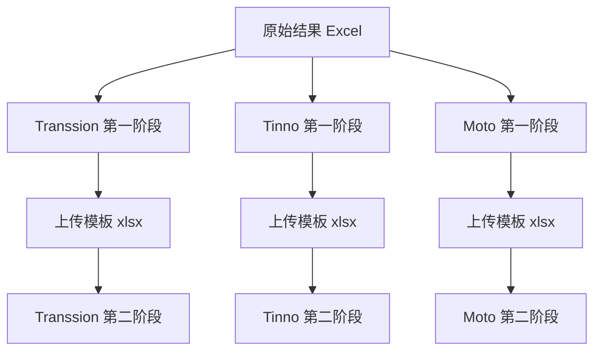

# stability_Jira-Automation

> 稳定性测试 Jira 批量提单工具集 — 三套独立工具，无共享父级代码
> 更新时间：2026-06-15

---

## 项目概述

将 Monkey / 稳定性测试结果 Excel 转为 Jira 上传模板，并批量建单或执行回归验证。按 Jira 环境拆分为三个**完全独立**的子目录：

| 工具目录 | Jira 环境 | 认证方式 |
|----------|-----------|----------|
| [Transsion_Jira_Tool_20260323](./Transsion_Jira_Tool_20260323/) | Transsion | Cookie / 账号 |
| [Tinno_Jira_Tool_20260520](./Tinno_Jira_Tool_20260520/) | Tinno | P12 + Cookie |
| [Moto_Jira_Tool_20251201](./Moto_Jira_Tool_20251201/) | Motorola edart (EKLAMUC) | Personal Access Token |

统一采用**两阶段流程**：

1. **第一阶段**：原始结果 Excel → `JIRA_Upload_List_*.xlsx`
2. **第二阶段**：上传模板 → Jira 建单 / dry-run / 回归验证

---

## 目录结构

```
stability_Jira-Automation/
├── openssl-1.1.1g.tar.gz         # 可选：旧 P12 链离线编译用 OpenSSL 1.1.1g 源码包
├── Transsion_Jira_Tool_20260323/   # Transsion 全套脚本、配置、测试
├── Tinno_Jira_Tool_20260520/       # Tinno 全套脚本、配置、测试
└── Moto_Jira_Tool_20251201/        # Moto 全套脚本、配置、文档
```

`openssl-1.1.1g.tar.gz` 供 Windows 等环境在系统 OpenSSL 3.x 无法加载 Tinno 旧 P12 证书链时离线编译 1.1.1g；解压目录 `openssl-1.1.1g/` 已 gitignore，仓库仅保留 tar 包。日常 P12 建单由 `Tinno_Jira_Tool_20260520/jira_p12_client.py` 通过 Python `cryptography` 降 SECLEVEL 完成，不强制依赖该 tar 包。

各工具目录内通用子目录：`config/`、`log/`、`result/`、`test/`（如有）。

---

## Transsion_Jira_Tool_20260323

**说明**: [readme.txt](./Transsion_Jira_Tool_20260323/readme.txt)

| 脚本 | 阶段 |
|------|------|
| `generate_transsion_jira_upload_list.py` | 一 |
| `create_transsion_jira_batch_from_excel.py` | 二 |

```powershell
cd Transsion_Jira_Tool_20260323
pip install -r requirements.txt
python generate_transsion_jira_upload_list.py --add-main-excel ".\resource\Result_xxx.xls"
python -m pytest test\ -q
```

`requirements.txt` 覆盖第一阶段、第二阶段及 `tools/`（含 `jira`、`python-dotenv`）。

---

## Tinno_Jira_Tool_20260520

**说明**: [readme.txt](./Tinno_Jira_Tool_20260520/readme.txt)

| 脚本 | 阶段 |
|------|------|
| `generate_tinno_jira_upload_list.py` | 一 |
| `create_tinno_jira_batch_from_excel.py` | 二 |

本地项目历史缓存由目录内 `tinno_database_manager.py` 提供（SQLite），不依赖父目录。

VFFCA 严格版本比较（fix 忽略 LX 板型、current↔build 区分板型）见 [readme.txt §6.1](./Tinno_Jira_Tool_20260520/readme.txt)。

```powershell
cd Tinno_Jira_Tool_20260520
pip install -r requirements.txt
python create_tinno_jira_batch_from_excel.py `
  --add-excel-file ".\result\JIRA_Upload_List_Tinno_xxx.xlsx" `
  --jira-cookie-jsessionid "<JSESSIONID>" `
  --jira-cookie-xsrf-token "<XSRF_TOKEN>" `
  --dry-run
python -m pytest test\ -q
```

---

## Moto_Jira_Tool_20251201

**说明**: [readme.txt](./Moto_Jira_Tool_20251201/readme.txt)、[Motorola_edart_JIRA_使用说明.md](./Moto_Jira_Tool_20251201/Motorola_edart_JIRA_使用说明.md)

| 脚本 | 作用 |
|------|------|
| `test_excel_to_jira_upload_list_moto.py` | 第一阶段：生成上传清单 |
| `test_excel_to_jira_motorola_edart_batch_create.py` | 第二阶段：批量建单 |
| `generate_motorola_excel_template.py` | 元数据 Excel 模板 |
| `test_jira_motorola_edart.py` | Jira 元数据获取 |
| `jira_motorola_edart_batch_update.py` | 批量更新 |

```powershell
cd Moto_Jira_Tool_20251201
pip install -r requirements.txt
python test_excel_to_jira_upload_list_moto.py --add-main-excel "path\to\Result_xxx.xls" --set-test-case Reboot
python test_excel_to_jira_motorola_edart_batch_create.py `
  --add-excel-file "JIRA_Upload_List_Moto_xxx.xlsx" `
  --set-jira-token "<TOKEN>" `
  --add-comments
```

---

## 架构关系



---

## 开发注意事项

- 三套工具**互不 import**，修改时只动对应目录
- 新功能保持 `*_upload_template_common.py` 与 `*_batch_jira_common.py` 分离
- Transsion 为 Tinno 的结构参考，但代码独立演进
- 日志写 `log/`，模板与结果写 `result/`
- Tinno 数据库相关改动后跑 `test/test_tinno_project_history_db.py`

---

## AI 辅助开发指引

1. 先确认目标 Jira 环境，进入对应子目录
2. 第一阶段只生成 Excel；第二阶段只做 Jira API 与回归
3. 各工具 `readme.txt` 为操作权威说明；本文件描述模块级结构
